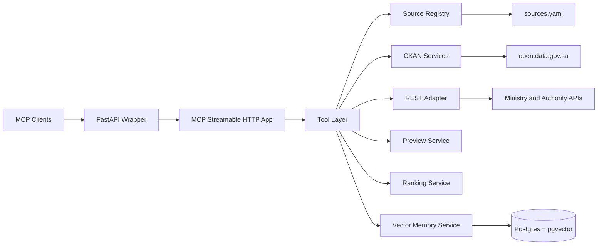

# KSA Open Data MCP 🇸🇦


> National-grade, read-only MCP server for Saudi open data catalog access + allowlisted ministry/authority API integration, with FastAPI gateway and built-in vector memory.

---

## 👑 Project Leadership

- **Ali Ghnaim** — visionary and strategist shaping the national direction.  
  LinkedIn: `https://www.linkedin.com/in/alighnaim/`
- **Haroon Shafqat** — project owner and the one who brought this initiative into life.  
  LinkedIn: `https://www.linkedin.com/in/haroon-shafqat/`  
  Website: `https://www.hwah.net`

---

## 📚 Table of Contents

- [1) What This Project Is](#1-what-this-project-is)
- [2) Why This MCP Exists](#2-why-this-mcp-exists)
- [3) Core Capabilities](#3-core-capabilities)
- [4) End-to-End Architecture](#4-end-to-end-architecture)
- [5) Runtime URL Map](#5-runtime-url-map)
- [6) One-Command Startup](#6-one-command-startup)
- [7) FastAPI Gateway Contract](#7-fastapi-gateway-contract)
- [8) MCP Tool Reference (All Tools)](#8-mcp-tool-reference-all-tools)
- [9) Source Allowlist (National Connectors)](#9-source-allowlist-national-connectors)
- [10) Built-in Vector Memory](#10-built-in-vector-memory)
- [11) CKAN Resilience Mode](#11-ckan-resilience-mode)
- [12) Security & Auth Posture](#12-security--auth-posture)
- [13) Quality Gates & Testing](#13-quality-gates--testing)
- [14) Formal Smoke Evidence](#14-formal-smoke-evidence)
- [15) Repository Structure](#15-repository-structure)
- [16) Contributor Workflow](#16-contributor-workflow)
- [17) Roadmap & Operational Notes](#17-roadmap--operational-notes)
- [18) Governance Docs](#18-governance-docs)
- [19) License](#19-license)

---

## 1) What This Project Is

`ksa-opendata-mcp` is a Saudi-focused MCP server designed for:

- unified discovery of public datasets,
- safe retrieval from allowlisted source APIs,
- deterministic tool contracts for agent integrations,
- production-friendly runtime with Docker and FastAPI.

It is intentionally **read-only**, explicitly allowlisted, and designed for interoperability with AI agents and developer tools (Cursor, ChatGPT apps, custom MCP clients).

---

## 2) Why This MCP Exists

Government and civic data consumers need one reliable integration point instead of dozens of incompatible source APIs and data portals. This project standardizes that through:

- a stable MCP tool surface,
- strict source governance (`sources.yaml`),
- auditable runtime behavior,
- bilingual and Arabic-aware retrieval support,
- transparent operational documentation.

---

## 3) Core Capabilities

### ✅ Protocol and API access

- Native MCP streamable HTTP endpoint (`/mcp/`).
- FastAPI wrapper (`/api/*`, `/docs`, `/openapi.json`).
- Health monitoring endpoint (`/health`).

### ✅ National source integration

- CKAN catalog integration (Saudi Open Data Platform).
- REST and API-key protected authority connectors.
- Endpoint-level allowlisting and host controls.

### ✅ Safe data handling

- Bounded previews (row/size limits).
- Read-only behavior by design.
- No write-back tools.

### ✅ Runtime memory

- PostgreSQL + `pgvector` semantic memory layer.
- Lightweight Arabic-friendly embedding strategy.
- Transparent `memory_search` tool for recall.

### ✅ Delivery ergonomics

- One-command startup script: `./ksa-mcp.sh`.
- Dockerized app + Postgres.
- Auto-generated Cursor and ChatGPT setup files.

---

## 4) End-to-End Architecture



### Runtime components

- **`server.py`**: MCP tool declarations and orchestration.
- **`fastapi_app.py`**: FastAPI API gateway + mounted MCP transport app.
- **`ksa_opendata/services/*`**: catalog/datastore/preview/ranking/memory services.
- **`docker-compose.yml`**: app + Postgres (`pgvector/pgvector:pg16`).

---

## 5) Runtime URL Map

### Primary local host

- Base URL: `http://ksa-opendata-mcp.localhost:8000`

### Human/API endpoints

- Health: `http://ksa-opendata-mcp.localhost:8000/health`
- OpenAPI schema: `http://ksa-opendata-mcp.localhost:8000/openapi.json`
- Swagger docs: `http://ksa-opendata-mcp.localhost:8000/docs`
- ReDoc: `http://ksa-opendata-mcp.localhost:8000/redoc`

### MCP endpoint

- MCP streamable HTTP: `http://ksa-opendata-mcp.localhost:8000/mcp/`

### FastAPI tool gateway

- Tool list: `http://ksa-opendata-mcp.localhost:8000/api/tools`
- Tool call: `http://ksa-opendata-mcp.localhost:8000/api/tools/{tool_name}`
- Welcome metadata: `http://ksa-opendata-mcp.localhost:8000/api/welcome`

### Static assets

- Icon URL: `http://ksa-opendata-mcp.localhost:8000/assets/ksa-mcp-icon-128.jpg`

### Container network equivalents

- MCP: `http://ksa-opendata-mcp:8000/mcp/`
- Tools API: `http://ksa-opendata-mcp:8000/api/tools`

---

## 6) One-Command Startup

```bash
./ksa-mcp.sh
```

### What startup does

- validates Docker availability,
- ensures `.env` exists (auto-creates defaults if missing),
- regenerates local connection config files:
  - `.cursor/mcp.json`
  - `reports/chatgpt_mcp_setup.json`
- builds/starts app + Postgres,
- runs health checks and API smoke checks,
- prints tool inventory and runtime URLs.

### Operational commands

```bash
./ksa-mcp.sh help
./ksa-mcp.sh status
./ksa-mcp.sh logs
./ksa-mcp.sh stop
./ksa-mcp.sh rebuild
./ksa-mcp.sh configure
```

---

## 7) FastAPI Gateway Contract

### Authentication behavior

- Controlled by `MCP_API_KEY_REQUIRED`.
- Default in this repository: `false` (public mode).
- When enabled, clients send: `X-API-Key: <FASTAPI_API_KEY>`.

### Main endpoints

- `GET /health`  
  runtime and memory readiness.
- `GET /api/welcome`  
  deployment metadata and integration hints.
- `GET /api/tools`  
  MCP tool listing.
- `POST /api/tools/{tool_name}`  
  invoke any MCP tool with JSON body args.
- `POST/GET /mcp/`  
  streamable MCP transport endpoint.

---

## 8) MCP Tool Reference (All Tools)

| Tool | Purpose | Typical Inputs | Typical Output |
|---|---|---|---|
| `list_sources()` | List configured connectors | none | source metadata list |
| `list_publishers(...)` | List catalog publishers | `source_id`, `query`, `limit` | publisher list |
| `search_datasets(...)` | Search and rank datasets | `query`, `publisher`, `rows`, `start` | dataset list + ranking |
| `get_dataset(...)` | Get normalized dataset detail | `dataset_id_or_name` | dataset metadata + resources |
| `get_resource(...)` | Get normalized resource metadata | `resource_id` | resource metadata |
| `preview_resource(...)` | Safe resource content preview | `resource_id` or `url`, `rows`, `max_bytes` | bounded preview payload |
| `publisher_summary(...)` | Publisher profile summary | `publisher`, `sample_rows` | top formats/tags + counts |
| `datastore_search(...)` | Query CKAN datastore shape | `resource_id`, `filters`, `limit`, `offset` | records + field schema |
| `call_source_endpoint(...)` | Call allowlisted REST endpoint | `source_id`, `endpoint`, `params` | raw source payload |
| `memory_search(...)` | Semantic search over prior tool responses | `query`, `limit` | ranked memory matches |

### Example (FastAPI tool call)

```bash
curl -sS -X POST "http://ksa-opendata-mcp.localhost:8000/api/tools/call_source_endpoint" \
  -H "Content-Type: application/json" \
  -d '{
    "source_id": "moh_hdp_api",
    "endpoint": "dataset_search_public",
    "params": {
      "search": "الصحة",
      "pageNumber": 1,
      "pageSize": 2
    }
  }'
```

---

## 9) Source Allowlist (National Connectors)

Configured in `sources.yaml`.

| Source ID | Type | Base URL |
|---|---|---|
| `ksa_open_data_platform` | `ckan` | `https://open.data.gov.sa` |
| `shc_open_data_apis` | `rest` | `https://services.shc.gov.sa/CouncilAPIs/api/CouncilAPIs` |
| `moh_hdp_api` | `rest` | `https://hdp.moh.gov.sa/api/v1` |
| `mcit_open_api` | `rest_api_key` | `https://api.mcit.gov.sa` |
| `sama_open_data_api` | `rest` | `https://data.sama.gov.sa` |
| `cchi_odata` | `rest` | `https://opendata.cchi.gov.sa/odata` |
| `gastat_api` | `rest` | `https://api.stats.gov.sa` |

Only endpoints explicitly declared per source are callable.

---

## 10) Built-in Vector Memory

### What it does

- Caches tool responses in PostgreSQL.
- Stores embedding vectors for semantic lookup.
- Exposes retrieval via `memory_search`.

### Why this design

- Very low compute overhead.
- Works well for mixed Arabic/English payloads.
- Improves repeated query performance and continuity.

### Main configuration keys

- `VECTOR_MEMORY_ENABLED`
- `VECTOR_MEMORY_TTL_SECONDS`
- `VECTOR_MEMORY_MAX_TEXT_CHARS`
- `EMBEDDING_MODEL_NAME` (default local lightweight profile)
- `EMBEDDING_DIM`
- `DATABASE_URL`

---

## 11) CKAN Resilience Mode

When CKAN upstream is blocked or returns non-JSON WAF pages in a given network, catalog tools automatically degrade into deterministic fallback mode using locally available ministry/entity metadata.

This keeps:

- tool contracts stable,
- MCP calls successful,
- contributor workflows unblocked.

Fallback coverage includes:

- `list_publishers`
- `search_datasets`
- `get_dataset`
- `get_resource`
- `publisher_summary`
- `datastore_search`

---

## 12) Security & Auth Posture

### Baseline safeguards

- Read-only tooling only.
- Explicit allowlist from `sources.yaml`.
- Host checks for outbound URLs.
- Response/preview bounds.
- Audit logging for tool calls.

### Auth controls

- Public mode supported for showcase/developer onboarding.
- API key mode available for hardened deployments.

### Environment variables

| Variable | Purpose |
|---|---|
| `FASTAPI_API_KEY` | API key used when auth is enabled |
| `MCP_API_KEY_REQUIRED` | toggles auth requirement |
| `MCP_PUBLIC_BASE_URL` | URL used in generated metadata/setup |
| `MCP_SERVER_NAME` | display/server name |
| `MCP_SERVER_DESCRIPTION` | integration-facing description |
| `MCP_ICON_URL` | integration-facing icon URL |
| `MCIT_API_KEY` | source auth key for MCIT connector |
| `POSTGRES_DB` / `POSTGRES_USER` / `POSTGRES_PASSWORD` | DB credentials |
| `DATABASE_URL` | Postgres connection string |

---

## 13) Quality Gates & Testing

### Static + dynamic validation

```bash
ruff check .
PYTHONPATH=. mypy ksa_opendata server.py fastapi_app.py
PYTHONPATH=. pytest
```

Recent baseline in this repo:

- `ruff`: pass
- `mypy` (app scope): pass
- `pytest`: pass

---

## 14) Formal Smoke Evidence

Latest formal tool-by-tool smoke artifacts:

- `reports/smoke_tool_report.md`
- `reports/smoke_tool_report.json`

These include:

- full tool inventory discovered live from MCP,
- invocation arguments per tool,
- pass/fail status per tool,
- key evidence snippets (counts, IDs, sample names),
- live source fetch proof (`moh_hdp_api`).

Additional evidence artifacts:

- `reports/fetch_validation_report.md`
- `reports/fetch_validation_report.json`
- `reports/govsa_entity_registry.json`
- `reports/govsa_ministries_registry.json`
- `reports/govsa_entity_registry.md`

---

## 15) Repository Structure

```text
.
├── server.py                         # MCP tools and orchestration
├── fastapi_app.py                    # FastAPI wrapper + mounted MCP app
├── docker-compose.yml                # app + postgres services
├── Dockerfile                        # container build
├── ksa-mcp.sh                        # one-command startup UX
├── sources.yaml                      # source/endpoint allowlist
├── ksa_opendata/
│   ├── config.py
│   ├── registry.py
│   ├── sources/
│   └── services/
├── contrib/                          # national entity/ministry scaffolds
├── docs/                             # architecture, API, security docs
├── tests/                            # unit + integration tests
└── reports/                          # generated validation artifacts
```

---

## 16) Contributor Workflow

1. Start stack: `./ksa-mcp.sh`
2. Confirm health: `./ksa-mcp.sh status`
3. Pick an entity/ministry backlog file in `contrib/`
4. Add source mapping / endpoint integrations
5. Add unit/integration tests
6. Run quality gates
7. Update reports/docs as needed

---

## 17) Roadmap & Operational Notes

### Planned hardening path

- stable public domain + TLS fronting,
- optional OAuth if deployment model requires it,
- expanded ministry-specific endpoint packs,
- richer query/ranking semantics,
- CI smoke automation for all MCP tools.

### Operational note

External source behavior can vary by network/WAF posture. This repository includes resilience logic and transparent reporting so behavior remains deterministic and auditable.

---

## 18) Governance Docs

- [Contributing Guide](CONTRIBUTING.md)
- [Code of Conduct](CODE_OF_CONDUCT.md)
- [Security Policy](SECURITY.md)
- [Docs Index](docs/README.md)
- [Architecture](docs/architecture.md)
- [Full API Reference](docs/api/API_REFERENCE_FULL.md)
- [Entity Registry Docs](docs/entity-registry.md)

---

## 19) License

MIT (see `pyproject.toml`).

---

Made with ❤️ by hrun and ali.
